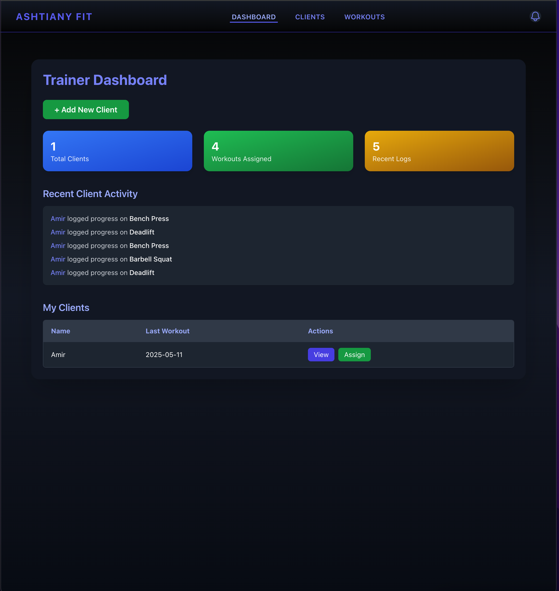
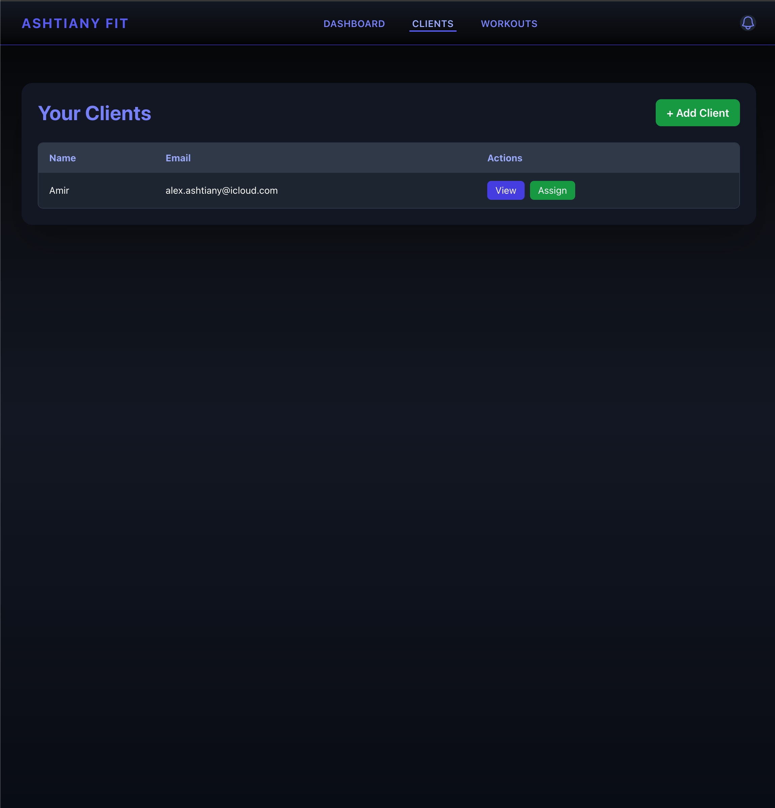
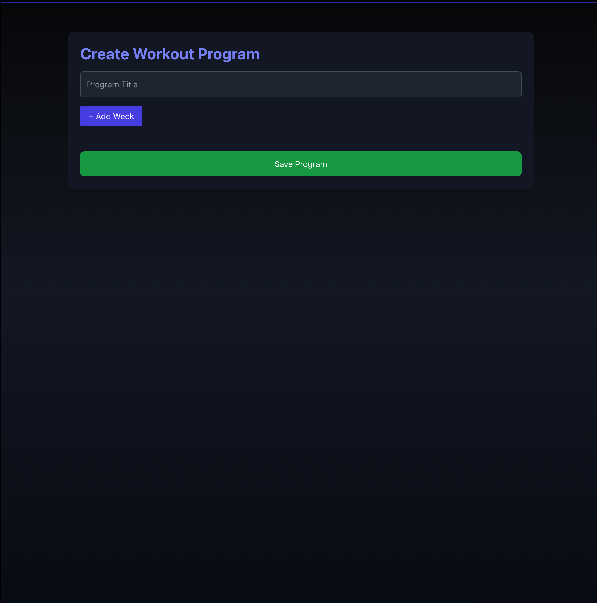
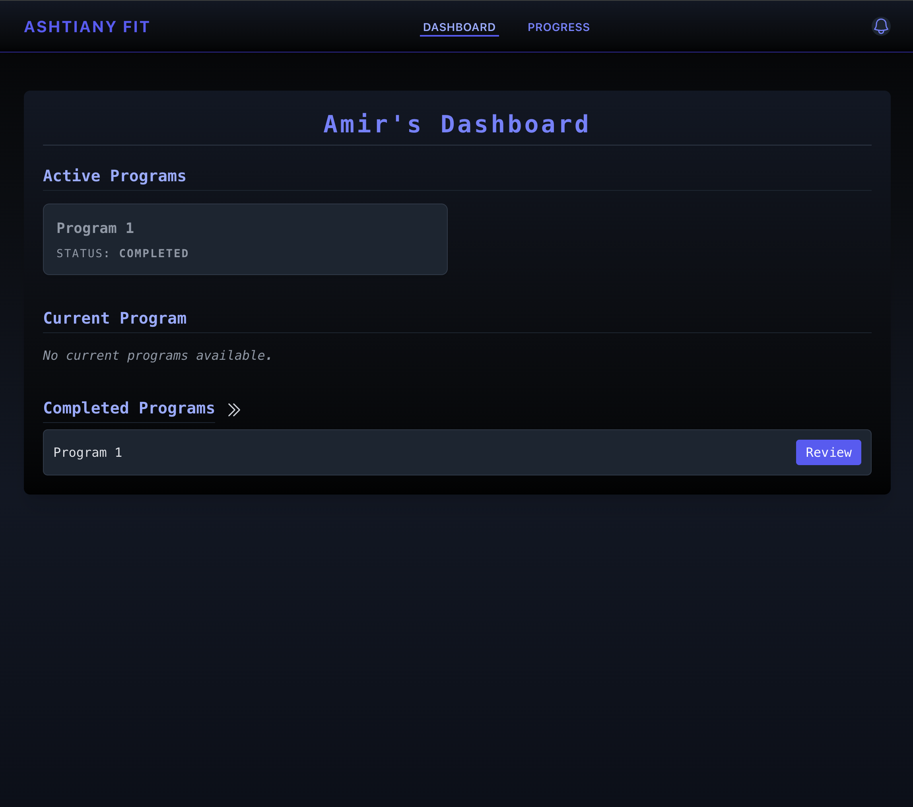
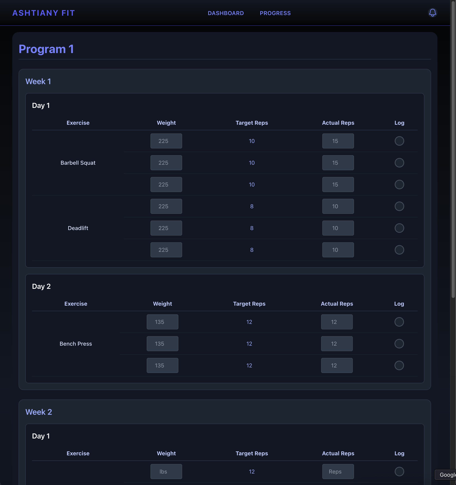

# Ashtiany Fit – Client & Trainer Management Platform

Ashtiany Fit is a full-stack SaaS fitness platform built to streamline personal training operations. It includes two distinct portals:

- **Client Dashboard** – For individuals to view and complete assigned workouts.
- **Trainer Dashboard** – For personal trainers to manage clients, assign workouts, and monitor progress.

---

## 🔧 Tech Stack

| Layer       | Tech                                   |
|-------------|----------------------------------------|
| Frontend    | React.js (Next.js), Tailwind CSS       |
| Backend     | Node.js, Express.js                    |
| Database    | PostgreSQL (via Prisma ORM)            |
| Hosting     | Vercel (Frontend) + Railway (Backend)  |
| Auth        | JSON Web Tokens (JWT)                  |
| API         | RESTful Architecture                   |

---

## 🧑‍💻 Trainer Dashboard Features

- Add new clients and view all assigned clients.
- Assign custom workout programs with weekly and daily breakdowns.
- Log real-time updates on client performance.
- Track workout completion and review logged data.

**Screenshots**  
  
  


---

## 🧍‍♂️ Client Dashboard Features

- View current and completed workout programs.
- Log actual reps, weight used, and duration.
- Autofill previous workout data for easier tracking.
- Receive updates when a trainer assigns a new program.

**Screenshots**  
  


---

## 🗂 Repo Structure

This project is split into two repositories:

- **Frontend**: `ashtiany-fit-frontend` (Next.js + Tailwind)
- **Backend**: `ashtiany-fit-backend` (Express.js + PostgreSQL)

---

## 🚀 Getting Started

### Frontend

```bash
cd ashtiany-fit-frontend
npm install
npm run dev
```

### Backend

```bash
cd ashtiany-fit-backend
npm install
npx prisma migrate dev
npm run dev
```

> Ensure you set up environment variables in both repos (`.env`) for DB and API URLs.

---

## ⚠️ Known Issues

- CORS errors may occur if frontend and backend URLs are not correctly whitelisted.
- Workout data caching can be stale unless logs are properly refetched after each save.